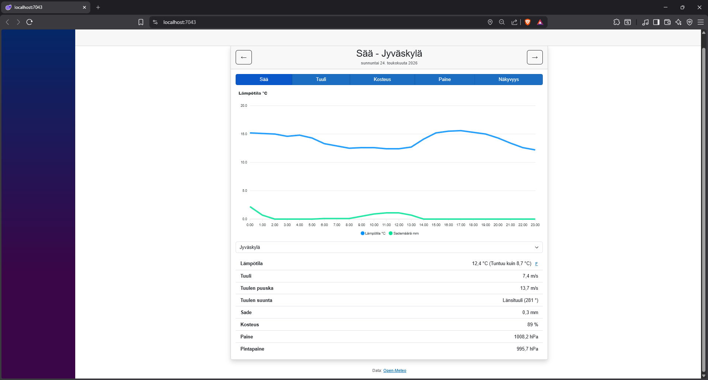

# Weather-App

Simple application that fetches weather data from api and displays it to the user



## Features
- Current weather conditions
- Hourly forecast chart
- Finnish municipality search
- Date navigation
- Celsius-Fahrenheit toggle
- Large amount of weather information

## Tech Stack
- Blazor Server (.NET 10)
- Open-Meteo API
- ApexCharts
- Bootstrap 5

## Getting Started

### Prequisities
- .NET 10 SDK

### Run Locally
1. Clone the repo
```bash
   git clone https://github.com/yourusername/weather-app.git
```
2. Navigate to the project folder
3. Run the app
```bash
   dotnet run
```
4. Open your browser at `https://localhost:PORT`

## Credits
Weather data provided by [Open-Meteo](https://open-meteo.com)

## License
MIT